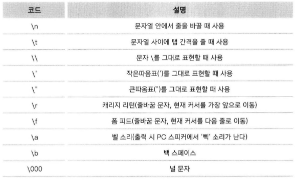
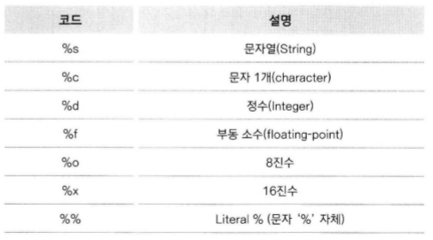

# 파이썬 프로그래밍의 기초, 자료형

-----

### 1. 숫자형

- 숫자 형태로 이루어진 자료형
- 정수, 실수, 복소수, 8진수, 16진수 등
- 숫자형을 활용하기 위한 연산자
    - 더하기, 빼기, 곱하기, 나누기, 나머지 연산
    - 제곱을 나타내는 연산자 : `a**b`
    - 나눗셈 후 소수점 아랫자리를 버리는 연산자 : `7//4`

-----

### 2. 문자열 자료형

- 문자, 단어 등으로 구성된 문자들의 집합
    - 아래와 같이 선언이 가능하다.
    ```python
    a = 'abc'
    b = "abc"
    c = """abc"""   # 여러 줄을 한번에 쓸 수 있다.
    d = '''abc'''   # 여러 줄을 한번에 쓸 수 있다.
    ```
    - 문자열 안에 작은 따옴표를 포함시킬 때 : 큰 따옴표(")로 묶는다.
    - 문자열 안에 큰 따옴표를 포함시킬 때 : 작은 따옴표(")로 묶는다.
    - 백슬래쉬(\\)를 사용해서 강제로 일반 문자로 인식시킬 수 있다.
    - 이스케이프 코드
        
- 문자열 연산
    - 문자열 더해서 연결하기
    ```python
    a = "this"
    b = "is python"
    print(a + b)
    ```
    - 문자열 곱하기
    ```python
    a = "hi!"
    print(a * 3)
    ```
- 문자열 인덱싱과 슬라이스
    - 인덱싱 : 저장한 문자열의 각 문자마다 번호를 매긴다.
    ```python
    s = "Life is too short, You need Python"
    print(a[0])     # 0 인덱스는 첫번째 인덱스를 가리킨다.
    print(a[-1])    # -1 인덱스는 마지막 인덱스를 가리킨다.
    ```
    - 슬라이스 : 시작과 끝을 정하여 받아 올 수 있다.
    ```python
    s = "Life is too short, You need Python"
    print(s[0:4]);  # 0 인덱스부터 3 인덱스까지 4개를 선택적으로 뽑는다.
    print(s[:4]);   # 첫 인덱스부터 3 인덱스까지 선택적으로 뽑는다.
    print(s[4:10])  # 4 인덱스부터 9 인덱스까지 선택적으로 뽑는다.
    print(s[4:])    # 4 인덱스부터 마지막 인덱스까지 선택적으로 뽑는다.
    print(s[:])     # 모든 인덱스를 뽑는다.
    ```
- 문자열 포매팅
    - 숫자 바로 대입
    ```python
    a = 150
    b = 20
    print("a is %d, and b is %d" % (a, b))
    ```
    - 문자열 포맷 코드
        
    - 정렬과 공백
       ```python
        s = "hi"
        print("%10s" % s)       # 10개의 칸을 주고 오른쪽 정렬
        print("%-10stest" % s)  # 10개의 칸을 주고 왼쪽 정렬
        ```
        - 소수점 표현하기
        ```python
        print("%10.4f" % 3.412321414123)    # 10개의 칸을 주고 소수점 아래는 4자리만 포함하고 오른쪽 정렬한다.
        ```
- 문자열 관련 함수
    - 문자 개수 세기(count)
    ```python
    s = "hobby"
    print(s.count('b'))
    ```
    - 위치 알려주기1(find)
    ```python
    s = "Python is best choice"
    print(s.find('b'))  # b가 처음 나온 위치, 문자가 존재하지 않는다면 -1
    ```
    - 위치 알려주기2(index)
    ```python
    s = "Life is too short"
    print(s.index('b')) # b가 처음 나온 위치, 문자가 존재하지 않는다면 에러
    ```
    - 문자열 삽입(join)
    ```python
    s = ','
    print(s.join('abcd'))   # abcd라는 문자열의 각각의 문자 사이에 변수 s의 값인 ','를 삽입한다.
    ```
    - 소문자를 대문자로 바꾸기(upper)
    ```python
    s = "hi"
    print(s.upper())
    ```
    - 대문자를 소문자로 바꾸기(lower)
    ```python
    s = "HI"
    print(s.lower())
    ```
    - 왼쪽 공백 지우기(lstrip)
    ```python
    s = " hi"
    print(s.lstrip())
    ```
    - 오른쪽 공백 지우기(rstrip)
    ```python
    s = "hi "
    print(s.rstrip())
    ```
    - 양쪽 공백 지우기(strip)
    ```python
    s = " hi "
    print(s.strip())
    ```
    - 문자열 바꾸기(replace)
    ```python
    s = "Life is too short"
    print(s.replace("short", "long"))
    ```
    - 문자열 나누기(split)
    ```python
    s ="Life is too short"
    print(s.split())    # 공백을 기준으로 나누고 리스트 형태로 리턴
    print(s.split('is'))    # is를 기준으로 나누고 리스트 형태로 리턴
    ```
- 고급 문자열 포매팅
    - 인덱스를 이용한 포매팅
    ```python
    print("{0}, {1}, {0}, {2}, {3}".format("first", "second", "third", "fourth"))
    ```
    - 이름을 이용한 포매팅
    ```python
    print("{first}, {second}, {fourth}, {second}".format(first=10, second=20, fourth=30))
    ```
    - 혼용한 포매팅
    ```python
    num = 1
    var = 10
    single = "solo"
    print("{0}, {var}, {string}".format(num, var=var, string=single))
    ```
    - 정렬
    ```python
    print("{0:<10}".format("hi"))   # 치환되는 문자열을 왼쪽으로 정렬하고 문자열의 총 자리수를 10으로 맞춘다.
    print("{0:>10}".format("hi"))   # 치환되는 문자열을 오른쪽으로 정렬하고 문자열의 총 자리수를 10으로 맞춘다.
    print("{0:^10}".format("hi"))   # 치환되는 문자열을 중앙으로 정렬하고 문자열의 총 자리수를 10으로 맞춘다.
    ```
    - 공백 채우기
    ```python
    print("{0:=^10}".format("hi"))  # 정렬을 실행한 뒤 공백을 '='문자로 채운다.
    print("{var:=^10}".format(var="hi"))  # 정렬을 실행한 뒤 공백을 '='문자로 채운다.
    ```
    - 소수점 표현하기
    ```python
    print("{0:0.4f}".format(3.124123123))   # 소수점 아래 4자리까지만 표현한다.
    print("{0:10.4f}".format(3.124123123))   # 총 10자리를 주고 소수점 아래 4자리까지만 표현한다.
    print("{var:10.4f}".format(var=3.124123123))   # 총 10자리를 주고 소수점 아래 4자리까지만 표현한다.
    ```
    - '{', '}'문자 표현하기
    ```python
    print("{{ and }}")  # 2회 반복하여 문자를 표현한다.
    ```

-----

### 3. 리스트 자료형

- 리스트의 생성
```python
a = []
b = [1, 2, 3]
c = ['Life', 'is', 'too', 'short']
d = [1, 2, 'Life', 'is']
e = [1, 2,['Life', 'is']]
```
- 리스트의 인덱싱과 슬라이싱
    - 인덱싱
        ```python
        a = [1, 2, 3]
        print(a)        # 리스트를 보여준다.
        print(a[0])     # 첫번째 인덱스에 들어있는 값을 보여준다.
        print(a[-1])    # 마지막 인덱스에 들어있는 값을 보여준다.
        ```
    - 슬라이싱
        ```python
        a = [1, 2, 3, 4, 5, 6]
        print(a)        # 리스트를 보여준다.
        print(a[0:4])   # 0 인덱스부터 3 인덱스까지 보여준다.(슬라이싱)
        print(a[:4])    # 첫 인덱스부터 3 인덱스까지 보여준다.(슬라이싱)
        print(a[2:5])   # 2 인덱스부터 4 인덱스까지 보여준다.(슬라이싱)
        print(a[2:])    # 2 인덱스부터 마지막 인덱스까지 보여준다.(슬라이싱)
        print(a[:])     # 모든 인덱스를 보여준다.(슬라이싱)
        ```
- 리스트 연산자
    - 더하기 : 뒤에 붙여준다.(append)
    - 곱하기 : 리스트를 반복한다.
- 리스트의 수정, 변경과 삭제
    - 수정
        ```python
        a = [1, 2, 3]
        a[1] = 10
        print(a)
        ```
    - 연속된 수정
        ```python
        a = [1, 2, 3, 4, 5]
        a[1:4] = ['a', 'b', 'c', 'd', 'e', 'f']
        print(a)
        ```
    - \[\] 사용한 요소 삭제
        ```python
        a = [1, 2, 3, 4, 5, 6, 7, 8]
        print(a)
        a[5:6] = []
        print(a)
        ```
    - del 함수를 사용한 요소 삭제
        ```python
        a = [1, 2, 3, 4, 5, 6, 7, 8]
        print(a)
        del a[1]
        print(a)
        del a[1:4]
        print(a)
        ```
- 리스트 관련 함수
    - 리스트에 요소 추가(append)
        ```python
        a = [1, 2, 3]
        a.append(4)     # 마지막에 붙여준다.
        ```
    - 리스트 정렬(sort)
        ```python
        a = [2, 3, 1, 0]
        a.sort()        # 리스트 자체를 정렬한다.
        ```
    - 리스트 뒤집기(reverse)
        ```python
        a = [1, 2, 3]
        a.reverse()     # 리스트 자체를 뒤집는다.
        ```
    - 위치 반환(index)
        ```python
        a = [1, 2, 3]
        print(a.index(2))   # 리스트에 2라는 값이 있으면 위치(인덱스)값을 리턴한다.
        print(a.index(0))   # 리스트에 0이라는 값이 있으면 위치(인덱스)값을 리턴한다. 0이라는 값이 존재하지 않기 때문에 오류를 발생시킨다.
        ```
    - 리스트에 요소 삽입(insert)
        ```python
        a = [1, 2, 3]
        a.insert(0, 4)  # 0 인덱스 위치에 4를 삽입한다. 원래 0 인덱스는 1 인덱스가 된다.
        ```
    - 리스트 요소 제거(remove)
        ```python
        a = [1, 2, 3]
        a.remove(2)     # 처음으로 나오는 2를 제거한다.
        ```
    - 리스트 요소 끄집어내기(pop)
        ```python
        a = [1, 2, 3]
        print(a.pop())  # 마지막 인덱스를 리턴하고 그 요소를 제거한다.
        ```
    - 리스트에 포함된 요소 x의 개수 세기(count)
        ```python
        a = [1, 2, 3, 1]
        print(a.count(1))   # 리스트에서 1의 개수를 리턴한다.
        ```
    - 리스트 확장(extend)
        ```python
        a = [1, 2, 3]
        a.extend([4, 5])    # 매개 변수로 리스트만 올 수 있는 더하기 함수이다.
        ```

-----

### 4. 튜플 자료형

-----

### 5. 딕셔너리 자료형

-----

### 6. 집합 자료형

-----

### 7. 자료형의 참과 거짓

-----

### 8. 자료형의 값을 저장하는 공간, 변수

