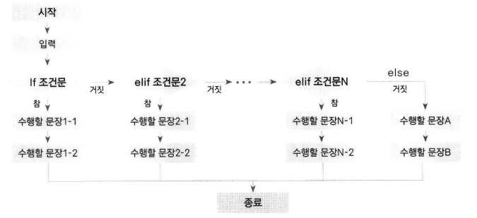
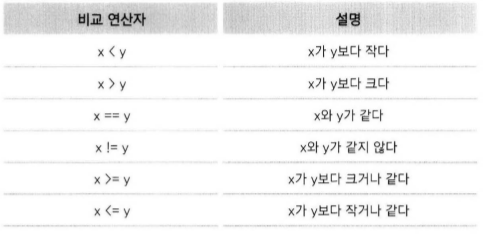
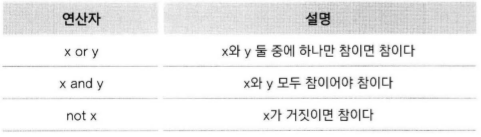
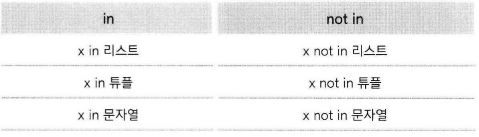
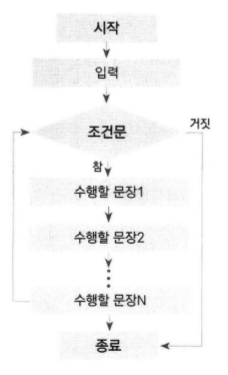

# 프로그램의 구조를 쌓는다! 제어문

-----

### 1. if문

- 형식
    ```python
    if [조건문]:
        # if의 조건식이 True일 때
        # 실행문
    elif [조건문]:
        # elif의 조건식이 True일 때
        # 실행문
    else:
        # 위의 조건식이 True인 것이 없을 때
        # 실행문
    ```

    
- 조건문 : 참과 거짓을 판단하는 문장
- 비교연산자 : 조건이 참인지 거짓인지 판단할 때 사용

    
- 논리연산자 : 조건이 참인지 거짓인지 판단할 때 사용

    
- x in s, x not in s

    
- pass : 현재 조건문을 빠져나간다???
    ```python
    for i in range(10):
        if i:
            print(i)
            pass
        print("counting")
        print("complete!")
    ```

-----

### 2. while문

- 기본 구조
    ```python
    while [조건문]:
        수행할 문장1
        수행할 문장2
        ...
    ```

    
    ```python
    treeHit = 0
    while treeHit < 10:
        treeHit += 1
        print("나무를 {0}번 찍었다.".format(treeHit))
        if treeHit == 10:
            print("나무가 넘어갑니다.")
    ```
- 강제로 빠져나가기 : `break`
- 조건에 맞지 않는 경우 맨 처음으로 돌아가기
    ```python
    cnt = 0
    while True:
        cnt += 1
        if a % 2 == 0:
            continue
        print(cnt)
        if a > 50:
            break
    # 51까지 출력된다.
    ```

-----

### 3. for문

- ㅎㅇㅎㅇ