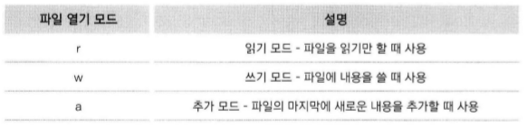

# 프로그램의 입력과 출력

-----

### 1. 함수

- 입력값을 가지고 어떤 일을 수행한 다음에 그 결과물을 내어놓는 것.
- 코드의 재사용
- 반복적으로 사용되는 가치 있는 부분
- 파이썬 함수의 구조
    ```python
    def 함수명(입력 인수):
        수행할 문장1
        수행할 문장2
        ...
    ```
    ```python
    def 함수명(입력 인수):
        수행할 문장
        ...
        return 결과값
    ```
    - 입력 인수가 없을 수 있다.
    - 입력 인수가 여러 개일 수 있다.
    - 결과값이 없는 함수일 수 있다.
    - 입력 인수와 결과값이 둘 다 없는 함수일 수 있다.
- 입력값이 몇 개가 될지 모를 때(\*\*)
    ```python
    def sum_many(*args):
        sum = 0
        for i in args:
            sum += i
        return sum

    res = sum_many(1, 2, 3, 4)
    print(res)
    ```
- 입력값이 몇 개가 될지 모를 때(\*\*)
    ```python
    def call(**kwargs):
        for key, value in kwargs.items():
            print("{0} is {1}".format(key, value))

    call(a=1, b=2, c=3)
    ```
- 입력 인수에 초깃값 미리 설정하기
    ```python
    def say_myself(name, old, man=True):
        print("나의 이름 {0}".format(name))
        print("나의 나이 {0}".format(old))
        if man:
            print("남자")
        else:
            print("여자")
    
    say_myself('Sam', 27)
    say_myself('Jane', 27, False)
    ```
- 함수 안에서 선언된 변수의 효력 범위
    - 함수 안에서 선언된 변수는 함수 안에서 수명을 다한다.
    ```python
    a = 1
    def life(a):
        a += 1      # 함수가 끝날 때 까지 a 는 2이다.

    print(a)        # a 는 1이다.
    life(a)
    print(a)        # a 는 1이다.
    ```
    ```python
    a = 1
    def life():
        global a    # 함수 외부에 있는 a에 직접 접근한다.
        a += 1
    
    life()
    print(a)
    ```
    ```python
    a = 1
    def life(a):
        a += 1
        return a    # 결과값을 주고 a에 대입한다.
    
    a = life(a)     # 호출과 대입
    print(a)
    ```

-----

### 2. 사용자 입력과 출력

- 사용자 입력
    - `input()`을 통해서 사용자에게 입력을 받을 수 있다.
- 출력
    - `print()`를 통해서 프롬프트에 출력할 수 있다.
    ```python
    for i in ragne(10):
        print(i, end=' ')
    ```
    - 문자열 띄어쓰기는 콤마로 한다.
    ```python
    print("life""is""too ""short")
    print("life""is""too", "short")
    print("life"+"is"+"too", "short")
    ```

-----

### 3. 파일 입출력

- 파일 생성
    ```python
    f = open("파일이름", '모드')
    ```

    
    - r : readonly  : 읽기 전용, 없으면 에러, 쓸 수 없다.
    - w : writeonly : 쓰기 전용, 없으면 생성, 존재하면 내용 삭제 후 작성
    - a : readwrite : 읽기 쓰기, 없으면 생성, 원래 있던 내용에 추가할 수 있다.
- 파일에 쓰기(write())
    ```python
    f = open("test.txt", 'a')
    for i in range(1, 11):
        data = "%d번째 줄입니다.\n" % i
        f.write(data)
    f.close()
    ```
- 파일 읽기(readline(), readlines(), read())
    - `readline()` : 한 줄을 문자열로 읽는다.
    - `readlines()` : 모든 라인을 읽어 리스트로 리턴한다.
    - `read()` : 모든 라인을 읽어 문자열로 리턴한다.
- 파일에 내용 추가 : 모드를 a로 하고 write()한다.
- with 사용
    - 파일을 열고 닫는 과정을 한번에 처리한다.
    ```python
    f = open("test.txt", 'w')
    f.write("hi")
    f.close()
    ```
    ```python
    with open("test.txt", 'w') as f:
        f. write("hi")
    ```