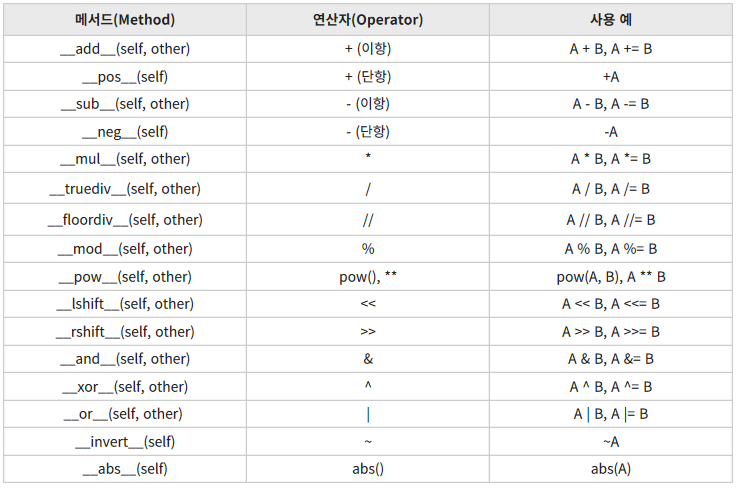

# 파이썬 날개 달기, 클래스

-----

### 1. 파이썬 프로그래밍의 핵심, 클래스

- 한 클래스로 만들어진 두 인스턴스는 독립적인 개체이다.
- 코드의 재사용이 쉬워진다.
- 객체와 인스턴스의 차이
    - 클래스에 의해서 만들어진 객체를 인스턴스라고 한다.
    - 객체 : Object
    - 인스턴스 : 특정 객체가 어떤 클래스의 객체인지를 관계 위주로 설명할 때 사용
- 클래스 기초
    - 클래스 변수
        ```python
        class Service:
            secret = "Top Secret"

        ob = Service()
        print(ob.secret)
        ```
        - Service 클래스가 제공하는 secret 변수를 사용할 수 있다.
    - 클래스 함수
        ```python
        class Service:
            secret = "Top Secret"
            def sum(self, a, b):
                result = a + b
                print("{0} + {1} = {2}".format(a, b, result))

        ob = Service()
        ob.sum(13, 15)
        ```
    - self
        - 함수가 call 받았을 때 call한 객체가 클래스의 인스턴스인지 확인
        ```python
        ob = Service()
        ob.sum(ob, 13, 15)
        ob.sum(13, 15)      # 같은 결과가 나온다.
        ```
        - 파이썬의 특징으로 클래스 내부 함수의 첫 번째 인수는 무조건 self로 해야 인스턴스 함수로 사용할 수 있다.
        ```python
        class Service:
            secret = "Top Secret"
            def setName(self, name):
                self.name = name
            def getName(self):
                return self.name
        
        ob = Service()
        ob.setName('Lee')
        print(ob.getName())
        ```
    - `__init__`
        - 인스턴스를 만들 때 항상 실행된다.
        ```python
        class Service:
            secret = "Top Secret"
            def __init__(self, name):
                self.name = name
            def getName(self):
                return self.name
        
        ob = Service('Lee')
        print(ob.getName())
        ```
- 클래스 구조
    - 다음과 같은 기본 구조를 갖고 있다.
    ```python
    class 클래스 이름[(상속 클래스명)]:
        <클래스 변수 1>
        <클래스 변수 2>
        ...
        <클래스 변수 n>
        def 클래스 함수1(self[, 인수1, 인수2, ...]):
            <수행할 문장 1>
            <수행한 문장 2>
            ...
        def 클래스 함수2(self[, 인수1, 인수2, ...]):
            <수행할 문장 1>
            <수행한 문장 2>
            ...
        def 클래스 함수3(self[, 인수1, 인수2, ...]):
            <수행할 문장 1>
            <수행한 문장 2>
            ..
    ```
- 예제 : 사칙연산 클래스
    ```python
    class Cal:
        def setData(self, a, b):
            self.a = a
            self.b = b
        def sum(self):
            return self.a + self.b
        def div(self):
            return self.a / self.b
        def sub(self):
            return self.a - self.b
        def mul(self):
            return self.a * self.b
    ```
- 예제 : '박씨네 집' 클래스
    ```python
    class HousePark:
        lastname = "박"
        def __init__(self, name):
            self.setName(name)
        def setName(self, name):
            self.firstname = name
            self.fullname = self.lastname + name
        def travel(self, where):
            print("{0}, {1}여행을 간다.".format(self.fullname, where))
    ```
- 상속
    - '물려받다'라는 뜻으로 어떤 클래스를 만들 때 다른 클래스를 만들 때 다른 클래스의 기능을 물려받을 수 있게 만드는 것이다.
    ```python
    class HouseLee(HousePark):
        lastname = "이"

    ob = HouseLee("파이")
    ob.travel("영동")
    ```
- 메서드 오버라이딩(method overriding)
    - 함수를 상속받았을 때 이름은 같지만 다른행동을 하게 할 때
    ```python
    class HouseLee(HousePark):
        lastname = "이"
        def travel(self, where, day):
            print("{0}, {1}여행 {2}일 가네.".format(self.fullname, where, day))

    ob = HouseLee("파이")
    ob.travel("영동", 13)
    # ob.travel("서해안") 에러!
    ```
- 연산자 오버로딩(operator overloading)
    - 연산자를 객체끼리 사용할 수 있게 하는 기법이다.
    ```python
    class HousePark:
        lastname = "박"
        def __init__(self, name):
            self.setName(name)
        def setName(self, name):
            self.firstname = name
            self.fullname = self.lastname + name
        def travel(self, where):
            print("{0}, {1}여행을 간다.".format(self.fullname, where))
        def __add__(self, other):
            print("{0}과 {1}은 결혼했다.".format(self.fullname, other.fullname))

    a = HousePark("노을")
    b = HousePark("가을")
    a + b
    ```

    
    
-----

### 2. 모듈

-----

### 3. 패키지

-----

### 4. 예외 처리

-----

### 5. 내장 함수

-----

### 6. 외장 함수
