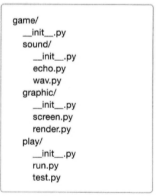
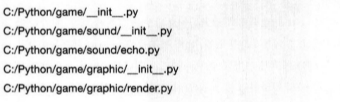
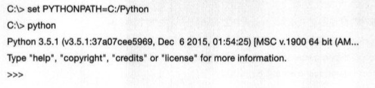
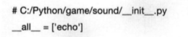

# 파이썬 날개 달기, 클래스

-----

### 1. 파이썬 프로그래밍의 핵심, 클래스

- 한 클래스로 만들어진 두 인스턴스는 독립적인 개체이다.
- 코드의 재사용이 쉬워진다.
- 객체와 인스턴스의 차이
    - 클래스에 의해서 만들어진 객체를 인스턴스라고 한다.
    - 객체 : Object
    - 인스턴스 : 특정 객체가 어떤 클래스의 객체인지를 관계 위주로 설명할 때 사용
- 클래스 기초
    - 클래스 변수
        ```python
        class Service:
            secret = "Top Secret"

        ob = Service()
        print(ob.secret)
        ```
        - Service 클래스가 제공하는 secret 변수를 사용할 수 있다.
    - 클래스 함수
        ```python
        class Service:
            secret = "Top Secret"
            def sum(self, a, b):
                result = a + b
                print("{0} + {1} = {2}".format(a, b, result))

        ob = Service()
        ob.sum(13, 15)
        ```
    - self
        - 함수가 call 받았을 때 call한 객체가 클래스의 인스턴스인지 확인
        ```python
        ob = Service()
        ob.sum(ob, 13, 15)
        ob.sum(13, 15)      # 같은 결과가 나온다.
        ```
        - 파이썬의 특징으로 클래스 내부 함수의 첫 번째 인수는 무조건 self로 해야 인스턴스 함수로 사용할 수 있다.
        ```python
        class Service:
            secret = "Top Secret"
            def setName(self, name):
                self.name = name
            def getName(self):
                return self.name
        
        ob = Service()
        ob.setName('Lee')
        print(ob.getName())
        ```
    - `__init__`
        - 인스턴스를 만들 때 항상 실행된다.
        ```python
        class Service:
            secret = "Top Secret"
            def __init__(self, name):
                self.name = name
            def getName(self):
                return self.name
        
        ob = Service('Lee')
        print(ob.getName())
        ```
- 클래스 구조
    - 다음과 같은 기본 구조를 갖고 있다.
    ```python
    class 클래스 이름[(상속 클래스명)]:
        <클래스 변수 1>
        <클래스 변수 2>
        ...
        <클래스 변수 n>
        def 클래스 함수1(self[, 인수1, 인수2, ...]):
            <수행할 문장 1>
            <수행한 문장 2>
            ...
        def 클래스 함수2(self[, 인수1, 인수2, ...]):
            <수행할 문장 1>
            <수행한 문장 2>
            ...
        def 클래스 함수3(self[, 인수1, 인수2, ...]):
            <수행할 문장 1>
            <수행한 문장 2>
            ..
    ```
- 예제 : 사칙연산 클래스
    ```python
    class Cal:
        def setData(self, a, b):
            self.a = a
            self.b = b
        def sum(self):
            return self.a + self.b
        def div(self):
            return self.a / self.b
        def sub(self):
            return self.a - self.b
        def mul(self):
            return self.a * self.b
    ```
- 예제 : '박씨네 집' 클래스
    ```python
    class HousePark:
        lastname = "박"
        def __init__(self, name):
            self.setName(name)
        def setName(self, name):
            self.firstname = name
            self.fullname = self.lastname + name
        def travel(self, where):
            print("{0}, {1}여행을 간다.".format(self.fullname, where))
    ```
- 상속
    - '물려받다'라는 뜻으로 어떤 클래스를 만들 때 다른 클래스를 만들 때 다른 클래스의 기능을 물려받을 수 있게 만드는 것이다.
    ```python
    class HouseLee(HousePark):
        lastname = "이"

    ob = HouseLee("파이")
    ob.travel("영동")
    ```
- 메서드 오버라이딩(method overriding)
    - 함수를 상속받았을 때 이름은 같지만 다른행동을 하게 할 때
    ```python
    class HouseLee(HousePark):
        lastname = "이"
        def travel(self, where, day):
            print("{0}, {1}여행 {2}일 가네.".format(self.fullname, where, day))

    ob = HouseLee("파이")
    ob.travel("영동", 13)
    # ob.travel("서해안") 에러!
    ```
- 연산자 오버로딩(operator overloading)
    - 연산자를 객체끼리 사용할 수 있게 하는 기법이다.
    ```python
    class HousePark:
        lastname = "박"
        def __init__(self, name):
            self.setName(name)
        def setName(self, name):
            self.firstname = name
            self.fullname = self.lastname + name
        def travel(self, where):
            print("{0}, {1}여행을 간다.".format(self.fullname, where))
        def __add__(self, other):
            print("{0}과 {1}은 결혼했다.".format(self.fullname, other.fullname))

    a = HousePark("노을")
    b = HousePark("가을")
    a + b
    ```

    

-----

### 2. 모듈

- 모듈이란?
    - 함수나 변수 또는 클래스들을 모아 놓은 파일이다. 모듈은 다른 파이썬 프로그램에서 불러와 사용할 수 있게끔 만들어진 파이썬 파일이라고도 할 수 있다.
    - 다른 사람들이 이미 만들어 놓은 모듈을 사용할 수도 있고, 우리가 직접 만들어서 사용할 수도 있다.
- 모듈 만들고 사용하기
    ```python
    # mod1.py
    def sum(a, b):
        return a + b
    # root 디렉토리 아래 Python 디렉토리를 생성하고 디렉토리 안에 저자한다.
    ```
    - mod1.py를 저장한 위치로 이동한 다음 이후 예제를 진행해야 대화형 인터프리터에서 mod1.py를 읽을 수 있다.
    ```python
    import mod1     # 모듈을 불러는 방법
    print(mod1.sum(3, 4))
    ```
- 모듈 함수를 사용하는 또 다른 방법 : `from 모듈이름 import 모듈함수`
- `if __name__ == "__main__":`의 의미
    - 직접 실행했을 때 실행할 코드를 의미한다.
    ```python
    # mod1.py
    PI = 3.141592
    class Math:
        def solv(self, r):
            return PI * (r ** 2)
    
    def sum(a, b):
        return a + b
    
    # 직접 실행했을 때 아래 코드를 실행시키겠다.
    if __name__ == "__main__":
        print(PI)
        a = Math()
        print(a.solv(3))
        print(sum(PI, 4.4))
    ```
- 모듈을 불러오는 또 다른 방법
    - sys.path.append(모듈을 저장한 디렉토리) 사용
    ```
    >>>import sys
    >>>sys.path
    >>>sys.path.append("모듈로 사용할 py파일을 저장한 디렉토리")
    ```
    - PYTHONPATH 환경변수 사용하기
    ```
    # 모듈로 사용할 py파일을 저장한 디렉토리를 PYTHONPATH 환경변수에 추가한다.
    set PYTHONPATH=C:\Python\Mymodule
    ```

-----

### 3. 패키지

- 패키지
    - 도트(.)를 이용하여 파이썬 모듈을 계층적(디렉토리 구조)으로 관리할 수 있게 해준다.
    - 파이썬 패키지는 디렉토리와 파이썬 모듈로 이루어진다.
    
    
    - 패키지 구조로 파이썬 프로그램을 만드는 것이 공동작업이나 유지보수 등 여러 면에서 유리하다.
    - 패키지 구조로 모듈을 만들면 다른 모듈과 이름이 겹치더라도 더 안전하게 사용할 수 있다.
- 패키지 만들기
    - 패키지 기본 구성 요소 준비하기
        
        
        - `__init__.py`는 비어있는 상태로 둔다.
        ```python
        # echo.py
        def echo_test():
            print("echo")
        ```
        ```python
        # render.py
        def render_test():
            print("render")
        ```
        - PYTHONPATH 환경변수에 등록한다.

        
- 패키지 안의 함수 실행하기
    ```python
    # echo 모듈을 import하여 실행
    import game.sound.echo
    game.sound.echo.echo_test()
    ```
    ```python
    # echo 모듈이 있는 디렉터리까지를 from .. import하여 실행
    from game.sound import echo
    echo.echo_test()
    ```
    ```python
    # echo_test 함수를 직접 import하여 실행
    from game.sound.echo import echo_test()
    echo_test()
    ```
    - 아래와 같이는 불가능하다
    ```python
    import game                 # game 디렉토리의 모듈 또는 game 디렉토리의
    game.sound.echo.echo_test() # __init__.py에 정의 된 것들만 참조 가능
    ```
    ```python
    import game.sound.echo.echo_test
    # 도트 연산자를 사용해서 import a.b.c 처럼 import할 때 가장 마지막 항목인 
    # c는 반드시 모듈 또는 패키지여야만 한다.
    ```
- `__init__.py`의 용도
    - 해당 디렉터리가 패키지의 일부임을 알려주는 역할을 한다.
    - game, sound, graphic 등의 패키지에 포함된 디렉토리에 `__init__.py` 파일이 없다면 패키지로 인식되지 않는다.
- `__all__`의 용도
    ```python
    from game.sound import *
    echo.echo_test()        # 오류 발생!!!
    ```
    - 특정 디렉토리의 모듈을 *를 이용하여 import할 때에는 다음과 같이 해당 디렉토리의 `__init__`파일에 `__all__`이라는 변수를 설정하고 import할 수 있는 모듈을 정의해 주어야한다.

    
- relative 패키지
    - 만약 graphic 디렉토리의 render.py 모듈일 sound 디렉토리의 echo.py 모듈을 사용하고 싶다면 render.py를 다음과 같이 수정한다.
    ```python
    # render.py
    from game.sound.echo import echo_test
    def render_test():
        print("render")
        echo_test()
    ```
    ```python
    # render.py
    from ..sound.echo import echo_test
    def render_test():
        print("render")
        echo_test()
    ```
    - ..과 같은 relative한 접근자는 render.py와 같이 모듈 안에서 사용해야 한다. 파이썬 인터프리터에서 사용하면 오류가 발생한다.

-----

### 4. 예외 처리

- 예외 처리 : 오류가 발생했을 때의 동작을 수정할 수 있다.
- 오류 예외 처리 기법 : try, except
    - try : 시도한다...
    - except : 오류가 발생하면...
        - `except [발생 오류[as 오류 메시지 변수]]:`
        ```python
        try:
            ...
        except:
            ...
        ```
        ```python
        try:
            ...
        except 발생 오류:
            ...
        ```
        ```python
        try:
            ...
        except 발생 오류 as 오류 메시지 변수:
            ...
        ```
        - 예시
        ```python
        try:
            a = 4 / 0
        except ZeroDivisionError as e:
            print(e)
        ```
- 오류 예외 처리 기법 : try .. else
    - else절은 예외가 발생하지 않은 경우 실행되며 반드시 except절 바로 다음에 위치해야 한다.
    ```python
    try:
        f = open('foo.txt', 'r')
    except FileNotFoundError as e:
        print(e)
    else:
        data = f.read()
        f.close()
    ```
- 오류 예외 처리 기법 : try .. finally
    - finally절은 try문 소행 도중 예외 발생 여부에 상과 없이 항상 수행된다.
    - 보통 finally절은 사용한 리소스를 close해야 할 경우에 많이 사용된다.
    ```python
    f = open('foo.txt', 'w')
    try:
        # 무언가를 수행한다.
    finally:
        f.close()
    ```
- 오류 회피하기
    - 특정 오류가 발생한 경우 그냥 통과시켜야 할 때가 있을 수 있다.
    ```python
    try:
        f = open('없는 파일', 'r')
    except FileNotFoundError:
        pass
    ```
- 오류 일부러 발생시키기
    - `raise`를 사용하여 오류를 일부러 발생시킬 수 있다.
    ```python
    class Bird:
        def fly(self):
            raise NotImplementedError

    class Eagle(Bird):
        def fly(self):          # 만들지 않았다면 오류가 발생한다!
            print('very fast')
    ```

-----

### 5. 내장 함수

- 아무런 설정 없이 바로 사용할 수 있다.
- abs(x)
    - 절대값을 반환
- all(x)
    - 반복 가능한 자료형 x를 입력 인수로 받아 모두 참이면 True, 하나라도 거짓이 있다면 False를 반환
- any(x)
    - 반복 가능한 자료형 x를 입력 인수로 받아 하나라도 참이 있면 True, 모두 거짓이라면 False를 반환
- chr(i)
    - 아스키 코드값을 입력으로 받아 그 코드에 해당하는 문자를 반환
- ord(c)
    - 문자를 입력으로 받아 그 문자에 해당하는 아스키 코드를 반환
- divmod(a, b)
    - 2개의 숫자를 입력으로 받아 a를 b로 나눈 몫과 나머지를 튜플 형태로 반환
- enumerate
    - 순서가 있는 자료형을 입력으로 받아 인덱스 값을 포함하는 enumerate 객체를 반환
    ```python
    for i, name in enumerate(['body', 'your', 'hot']):
        print(i, name)
    ```
- eval(expression)
    - 실행 가능한 문자열(1+2, 'hi'+'a')을 입력으로 받아 문자열을 실행한 결과값을 반환
    - 입력받은 문자열로 파이썬 함수나 클래스를 동적으로 실행하고 싶은 경우에 사용된다.
- filter(함수이름, 함수에 들어갈 반복 가능한 자료형)
    - 두 번째 인수인 반복 가능한 자료형 요소들이 첫 번째 인수인 함수에 입력되었을 때 리턴값이 참인 것만 묶어서 돌려준다.
    ```python
    def positive(numberList):
        result = []
        for num in numberList:
            if num > 0:
                result.append(num)
        return result
    print(positive([1, -3, 2, 0, -5, 6]))
    ```
    ```python
    def positive(x):
        return > 0
    print(list(filter(postive,[1, -3, 2, 0, -5, 6])))
    ```
- id(object)
    - 객체를 입력받아 객체의 고유 주소값(레퍼런스)을 반환
- input(\[prompt\])
    - 사용자 입력을 받는다.
- int(x), int(x, radix)
    - int(x) : 문자열 형태의 소수나 소수점 있는 숫자 등을 정수로 반환
    - int(x, raidx) : 진수로 표현된 문자열s를 10진수로 변환하여 반환
    ```python
    print(int('10A', 16))
    ```
- isinstance(object, class)
    - 첫 번째 인수로 인스턴스, 두 번째 인수로 클래스 이름을 받아 인스턴스가 클래스의 인스턴스인지 판단하여 참이면 True, 거짓이면 False를 반환
- lambda
    - 함수를 생성할 때 사용하는 예약어
    - def와 동일한 역할을 한다.
    - 함수를 한줄로 간결하게 만들 대 사용한다.
    - def를 사용할 수 없는 곳에 주로 쓰인다.
    - 생성 : `lambda 인수1, 인수2, ...: 인수를 이용한 표현식`
    ```python
    sum = lambda a, b: a + b
    print(sum(3, 4))
    ```
    ```python
    # 리스트 내에서도 사용 가능하다.
    myList = [lambda a, b: a + b, lambda a, b: a * b]
    print(myList[0](3, 4))  # 덧셈
    print(myList[1](3, 4))  # 곱셈
    ```
- len(s)
    - 입력값 s의 길이(요소의 전체 개수)를 반환
- list(s)
    - 반복 가능한 자료형 s를 입력받아 리스트로 만들어 반환
- map(f, iterable)
    - 함수(f)와 반복 가능한(iterable) 자료형을 입력으로 받는다.
    - map은 입력 받은 자료형의 각 요소와 함수 f에 의해 수행된 결과를 묶어서 반환
    ```python
    def two_times(numberList):
        result = []
        for number in numberList:
            result.append(number * 2)
        return result
    res = two_times([1, 2, 3, 4])
    print(res)
    ```
    ```python
    def two_times(x): return x * 2
    print(list(map(two_times, [1, 2, 3, 4])))
    ```
    ```python
    print(list(map(lambda a: a * 2, [1, 2, 3, 4])))
    ```
- max(iterable)
    - 반복 가능한 자료형을 입력받아 그 최대값을 반환
- min(iterable)
    - 반복 가능한 자료형을 입력받아 그 최소값을 반환
- oct(x)
    - 정수 형태의 숫자를 8진수 문자열로 바꾸어 반환
- hex(x)
    - 정수값을 입력받아 16진수로 변환하여 반환
- open(filename, \[mode\])
    - 파일이름과 읽기 방법을 입력받아 파일 객체를 반환
- pow(x, y)
    - x의 y승한 결과값을 반환
- range(\[start,\] end\[, step\])
    - for문과 함께 자주 사용되는 함수
    - 입력받은 숫자에 해당하는 범위를 반복 가능한 객체로 만들어 반환
    - 인수가 하나일 경우
    ```python
    print(list(range(10)))
    ```
    - 인수가 2개일 경우
    ```python
    print(list(range(0, 10)))
    ```
    - 인수가 3개일 경우
    ```python
    print(list(range(0, 10, 2)))
    ```
- sorted(iterable)
    - 입력갑을 정렬한 후 그 결과를 리스트로 반환
    ```python
    numlist = [3, 6, 2, 8, 1]
    print(sorted(numlist))
    print(numlist)
    numlist.sort()
    print(numlist())
    ```
- str(object)
    - 문자열 형태로 객체를 변환하여 반환
- tuple(iterable))
    - 반복 가능한 자료형을 입력받아 튜플 형태로 변환하여 반환
- type(object)
    - 입력값의 자료형이 무엇인지 알려주는 함수
- zip(iterable*)
    - 동일한 개수로 이루어진 자료형을 묶어 주는 역할을 하는 함수
    ```python
    list(zip([1, 2, 3], [4, 5, 6]))
    ```

-----

### 6. 외장 함수

- p