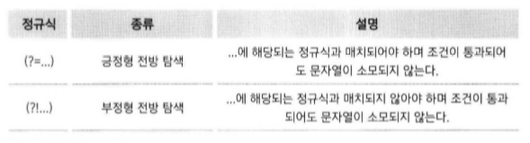

# 파이썬 정규 표현식과 XML

-----

### 1. 정규 표현식 살펴보기

- 정규식의 필요성
    - 장황한 parsing을 간편하고 직관적인 코드로 대체할 수 있다.

```python
data = """
park 800905-1049118
kim 700905-1059119
"""

result = []
for line in data.split('\n'):
    word_result = []
    for word in line.split(' '):
        if len(word) == 14 and word[:6].isdigit() and word[7:].isdigit():
            word = word[:6] + "-" + "*******"
        word_result.append(word)
    result.append(' '.join(word_result))
print('\n'.join(result))
```
```python
import re

data = """
park 800905-1049118
kim 700905-1059119
"""

pat = re.compile("(\d{6})[-]\d{7}")
print(pat.sub("\g<1>-*******", data))
```

-----

### 2. 정규 표현식 시작하기

- 정규 표현식에서 사용하는 메타문자 : `. ^ $ * + ? { } [ ] \ | ( )`
- 문자 클래스 `[ ]`
    - `[와 ] 사이의 문자들과 매치`

    
    - 두 문자 사이에 하이픈(-)을 사용하게 되면 두 문자 사이의 범위를 의미함.
    - 하나의 문자라도 같은게 있다면 매치된다.
    - ^은 not을 의미한다. : `[^0-9]`은 숫자가 아닌 문자만 매치된다.

    
- Dot(.)
    - 정규 표현식의 Dot(.) 메타 문자는 줄바꿈 문자인 \n을 제외한 모든 문자와 매치됨을 의미한다.
    - `a.b` : a와 b사이에 줄바굼 문자를 제외한 어떤 문자가 들어가도 매치됨.
    
    
    - `a[.]b` : a와 b 사이에 Dot(.) 문자가 있으면 매치
- 반복(*)
    - `ca*t` : a가 0번이상 반복되면 매치
    
    
- 반복(+)
    - `ca+t` : a가 1번 이상 반복되면 매치

    
- 반복({m, n}, ?)
    - `ca{2}t` : a가 2번 반복되면 매치
    - `cat{2,5}t` : a가 2번이상 5번이하로 반복되면 매치
    - `ca?t` : a가 0번 또는 1번 반복되면 매치
- 파이썬에서 정규 표현식을 지원하는 모듈 : re 모듈
    - `import re`
    
    
    - match
        - 문자열의 처음부터 정규식과 매치되는지 조사한다.
        ```python
        import re
        p = re.compile('[a-z]+')
        m = p.match("python")       # 부합
        m = p.match("3 python")     # 3이라는 문자가 정규식에 부합하지 않음
        ```
        ```python
        # 코딩 예시
        import re
        p = re.compile(정규식)
        m = p.match("조사할 문자열")
        if m:
            매치
        else:
            매치 안됨
        ```
        - match 객체를 반환한다.
    - match 객체의 메서드

        
    - search
        - 문자열 전체를 검색하기 때문에 '3 python'에서 'python'과 매치된다.
    - findall
        - 정규식과 매치되는 것을 리스트 형태로 반환한다.
    - finditer
        - findall과 동일하지만 그 결과로 반복 가능한 객체를 반환한다. 각각의 요소는 match 객체이다.
    - 모듈 단위로 수행하기
        ```python
        p = re.compile('[a-z]+')
        m = p.match("python")
        ```
        ```python
        m = re.match('[a-z]+', "python")
        ```
- 컴파일 옵션
    
    
- 백슬레쉬 문제
    - 정규 표현식을 파이썬에서 혼란을 주는 요소 : 백슬래쉬
    - "\\section"을 찾을 때 `p = re.compile('\\section')`을 사용해야 한다.
    - Raw String임을 알려주는 r
    - `p = re.compile('\\section')` == `p = re.compile(r'\sectino')`

-----

### 3. 강력한 정규 표현식 세계로

- 메타 문자
    - | : or과 동일하다.
    - ^ : 문자열의 맨 처음과 일치함을 뜻한다.
    - $ : 문자열의 맨 뒤와 일치함을 뜻한다.
    - \\A : ^와 동일한 의미이지만 re.MULTILINE 옵션을 사용할 때는 라인과 상관없이 전체 문자열의 처음하고만 매치된다.
    - \\Z : $와 동일한 의미이지만 re.MULTILINE 옵션을 사용할 때는 라인과 상관없이 전체 문자열의 끝과 매치된다.
    - \\b : 단어 구분자(whitespace)에 의해 구분된다. 백스페이스와 차별화 해야하기 때문에 기호 r을 꼭 붙여야 한다.
    - \\B : \\b와 반대로 whitespace가 아닌 경우에만 매치된다.
- 그룹핑
    - 문자열의 반복을 확인하기위해 그룹을 반들어 매칭한다.
    - `(ABC)+` : ABC와 1번 이상 매치되는 것을 찾는다!!
        ```python
        import re
        p = re.compile('(ABC)+')
        m = p.search('ABCABCABC OK?')
        ```
- 그룹핑된 문자열에 이름 붙이기
    - 그룹을 인덱스가 아닌 이름을 참조할 수 있다.
        - `(?P<name>\w+)\s+((\d+)[-]\d+[-]\d+)`
        - `(?P<이름>...)` 과 같이 이름을 붙일 수 있다.
    - 전방 탐색

        
        - 긍정형 전방 탐색
        - 부정형 전반 탐색
- 문자열 바꾸기
    - sub 메소드
    - sub 메소드와 유사한 subn 메소드
- Greedy vs Non-Greedy
    - 다시 한번 볼 필요가 있다.

-----

### 4. 파이썬으로 XML 처리하기

- XML을 처리할 여러가지 라이브러리가 존재한다.
- 이 책에선 ElementTree를 사용한다.
```xml
<!-- 생성하려는 xml -->
<note date="20151231">
    <to>Tove</to>
    <from>Jani</from>
    <heading>Reminder</heading>
    <body>Don't forget me this weekend!</body>
</note>
```
```python
from xml.etree.ElementTree import Element, dump

note = Element("note")
to = Element("to")
to.text = "Tove"
note.append(to)
dump(note)
```
- 위의 소스의 실행 결과는 다음과 같다.  
`<note><to>Tove</to></note>`
- SubElement를 이용하면 더 편리하게 태그를 추가할 수 있다.
```python
from xml.etree.ElementTree import Element, dump

note = Element("note")
to = Element("to")
to.text = "Tove"

note.append(to)
SubElement(note, "from").text = "Jani"

dump(note)
```
- 위의 소스의 실행결과는 다음과 같다.  
`<note><to>Tove</to><from>Jani</from></note>`
- 다음과 같이 태그 사이에 태그를 추가하거나 특정 태그를 삭제할 수 있다.
```python
dummy = Element("dummy")
note.insert(1, dummy)
note.remove(dummy)
```
- 애트리뷰트 추가
```python
from xml.etree.ElementTree import Element, dump

note = Element("note")
to = Element("to")
to.text = "Tove"

note.append(to)
SubElement(note, "from").text = "Jani"
note.attrib["date"] = "20120104"

dump(note)
```
- 목표 XML 소스
```python
from xml.etree.ElementTree import Element, dump

note = Element("note")
note.attrib["date"] = "20151231"

subElement(note, "to").text = "Tove"
SubElement(note, "from").text = "Jani"
SubElement(note, "heading").text = "Reminder"
SubElement(note, "body").text = "Don't forget me this weekend!"

dump(note)
```
- indent 함수
    - 정렬된 형태의 xml 값을 보기위한 함수
    ```python
    from xml.etree.ElementTree import Element, dump

    note = Element("note")
    note.attrib["date"] = "20151231"

    subElement(note, "to").text = "Tove"
    SubElement(note, "from").text = "Jani"
    SubElement(note, "heading").text = "Reminder"
    SubElement(note, "body").text = "Don't forget me this weekend!"

    def indent(elem, level=0):
        i = '\n' + level * ' '
        if len(elem):
            if not elem.text or not elem.text.strip():
                elem.text = i + ' '
            if not elem.tail or not elem.tail.strip():
                elem.tail = i
            for elem in elem:
                indent(elem, level+1)
            if not elem.tail or not elem.tail.strip():
                elem.tail = i
        else:
            if level and (not elem.tail or not elem.tail.strip()):
                elem.tail = i

    indent(note)
    dump(note)
    ```
- XML 문서 파싱하기
    ```python
    from xml.etree.ElementTree import parse
    tree = parse("note.xml")
    note = tree.getroot()
    
    # 어트리뷰트 얻기
    date = note.get("date")
    nodata = note.get("nodata", "기본값")
    keys = note.keys()
    items = note.items()

    # 태그 접근
    to_tag = note.find("to")
    to_tags = note.findall("to")
    to_text = note.findtext("to")
    # 순차 접근
    childs = note.getiterator()
    childs = note.getChildren()
    # 태그명으로 접근
    from_tag = note.getiterator("from")
    # 일반적인 사용
    for parent in tree.getiterator():
        for child in parent:
            # 수행 문장
    ```