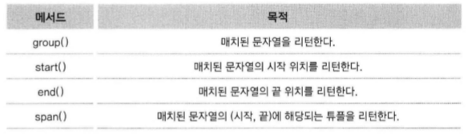

# 파이썬 정규 표현식과 XML

-----

### 1. 정규 표현식 살펴보기

- 정규식의 필요성
    - 장황한 parsing을 간편하고 직관적인 코드로 대체할 수 있다.

```python
data = """
park 800905-1049118
kim 700905-1059119
"""

result = []
for line in data.split('\n'):
    word_result = []
    for word in line.split(' '):
        if len(word) == 14 and word[:6].isdigit() and word[7:].isdigit():
            word = word[:6] + "-" + "*******"
        word_result.append(word)
    result.append(' '.join(word_result))
print('\n'.join(result))
```
```python
import re

data = """
park 800905-1049118
kim 700905-1059119
"""

pat = re.compile("(\d{6})[-]\d{7}")
print(pat.sub("\g<1>-*******", data))
```

-----

### 2. 정규 표현식 시작하기

- 정규 표현식에서 사용하는 메타문자 : `. ^ $ * + ? { } [ ] \ | ( )`
- 문자 클래스 `[ ]`
    - `[와 ] 사이의 문자들과 매치`

    
    - 두 문자 사이에 하이픈(-)을 사용하게 되면 두 문자 사이의 범위를 의미함.
    - 하나의 문자라도 같은게 있다면 매치된다.
    - ^은 not을 의미한다. : `[^0-9]`은 숫자가 아닌 문자만 매치된다.

    
- Dot(.)
    - 정규 표현식의 Dot(.) 메타 문자는 줄바꿈 문자인 \n을 제외한 모든 문자와 매치됨을 의미한다.
    - `a.b` : a와 b사이에 줄바굼 문자를 제외한 어떤 문자가 들어가도 매치됨.
    
    
    - `a[.]b` : a와 b 사이에 Dot(.) 문자가 있으면 매치
- 반복(*)
    - `ca*t` : a가 0번이상 반복되면 매치
    
    
- 반복(+)
    - `ca+t` : a가 1번 이상 반복되면 매치

    
- 반복({m, n}, ?)
    - `ca{2}t` : a가 2번 반복되면 매치
    - `cat{2,5}t` : a가 2번이상 5번이하로 반복되면 매치
    - `ca?t` : a가 0번 또는 1번 반복되면 매치
- 파이썬에서 정규 표현식을 지원하는 모듈 : re 모듈
    - `import re`
    
    
    - match
        - 문자열의 처음부터 정규식과 매치되는지 조사한다.
        ```python
        import re
        p = re.compile('[a-z]+')
        m = p.match("python")       # 부합
        m = p.match("3 python")     # 3이라는 문자가 정규식에 부합하지 않음
        ```
        ```python
        # 코딩 예시
        import re
        p = re.compile(정규식)
        m = p.match("조사할 문자열")
        if m:
            매치
        else:
            매치 안됨
        ```
        - match 객체를 반환한다.
    - match 객체의 메서드

        
    - search
        - 문자열 전체를 검색하기 때문에 '3 python'에서 'python'과 매치된다.
    - findall
        - 정규식과 매치되는 것을 리스트 형태로 반환한다.
    - finditer
        - findall과 동일하지만 그 결과로 반복 가능한 객체를 반환한다. 각각의 요소는 match 객체이다.
    - 모듈 단위로 수행하기
        ```python
        p = re.compile('[a-z]+')
        m = p.match("python")
        ```
        ```python
        m = re.match('[a-z]+', "python")
        ```
- 컴파일 옵션
    
    
- 백슬레쉬 문제
    - 정규 표현식을 파이썬에서 혼란을 주는 요소 : 백슬래쉬
    - "\\section"을 찾을 때 `p = re.compile('\\section')`을 사용해야 한다.
    - Raw String임을 알려주는 r
    - `p = re.compile('\\section')` == `p = re.compile(r'\sectino')`

-----

### 3. 강력한 정규 표현식 세계로

-----

### 4. 파이썬으로 XML 처리하기
